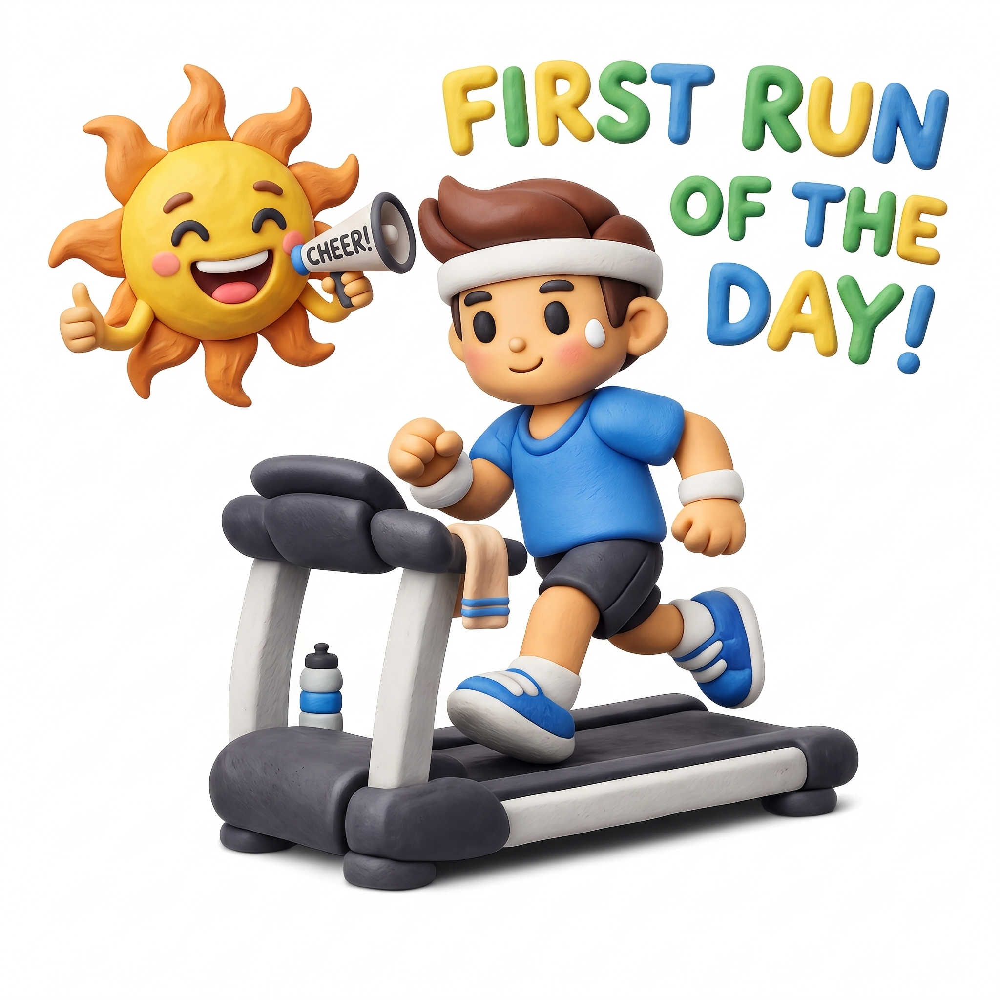

# Treadmill Tracker

A Windows desktop app that tracks walking sessions on a Bluetooth-enabled
treadmill and pushes them to Strava as **Walk** / **Jog** / **Run** activities.

Built originally to log distance toward a Conqueror Virtual Challenge.



---

## Features

- **Auto session detection** — start, pause, and finish are recognized from
  the treadmill's BLE telemetry. Stepping off briefly (e.g. for water) doesn't
  end the workout; the session resumes when motion continues.
- **Live metrics** — speed, distance, steps, calories, and elapsed time
  update as you walk. Step count is read from the treadmill's vendor BLE
  characteristic.
- **System tray** — minimize-to-tray with a walking-icon animation while
  active, an idle icon while connected but stopped.
- **Strava upload** — completed walks post automatically as the right
  sport type. Activities are queued locally and retried at next launch if
  Strava can't be reached. OAuth tokens are stored in the Windows Credential
  Manager.
- **Local session log** — every walk is saved to JSON under
  `%LocalAppData%/TreadmillApp/`. The app also tracks daily totals, daily
  goal progress, and a consecutive-days streak.
- **Walk / Jog / Run classification** — average-speed thresholds (configurable)
  determine how the activity is named and which Strava `sport_type` is sent.
- **Configurable** — pause tolerance, minimum-walk thresholds (filter
  treadmill spin-up false starts), daily distance and step goals, and the
  jog/run cutoffs are all editable from the Settings dialog.

---

## Hardware

Built and tested with the **FS-18F451** treadmill, which exposes the standard
Bluetooth **Fitness Machine Service** (FTMS, UUID `0x1826`) for live
speed/distance/calories/elapsed-time, plus a vendor characteristic
(UUID `0x0000fff1`) carrying step count.

Most BLE treadmills that speak FTMS should work for the live-metrics and
Strava upload features. Step count requires the same vendor packet format,
so YMMV on other hardware.

---

## Building

Requires:
- Windows 10 build 19041 (20H1) or later
- .NET 8 SDK

From the command line:

```
dotnet build src/TreadmillApp.sln -c Release
```

Or open `src/TreadmillApp.sln` in Visual Studio 2022 and build.

The output (a single self-contained WPF app) lands at
`src/TreadmillApp/bin/Release/net8.0-windows10.0.19041.0/TreadmillApp.exe`.

---

## First-time setup

1. **Pair the treadmill with Windows.** Settings → Bluetooth → Add device.
2. **Launch the app** and click **File → Settings → Device → Scan**.
3. **Select your treadmill** from the list and click **Connect**. The app
   remembers it for next time — Quick Connect from the main window will
   reconnect on subsequent runs.
4. **Walk!** Walks are saved locally even if you don't set up Strava.

### Optional: Strava integration

1. Register a personal API application at
   [strava.com/settings/api](https://www.strava.com/settings/api). Set
   **Authorization Callback Domain** to `localhost`.
2. In **Settings → Strava**, paste the **Client ID** and **Client Secret**
   shown on the Strava page, then click **Save Credentials**.
3. Click **Connect to Strava…** — your browser opens for the standard OAuth
   consent flow. Approve the app and the browser tab confirms success.
4. Future walks upload automatically. Pending walks (e.g. saved while
   offline) retry on the next app launch.

Tokens are stored in Windows Credential Manager (DPAPI-encrypted, scoped to
your Windows user). They never touch the working directory.

---

## License

[MIT](LICENSE) — see the LICENSE file for the full text.
